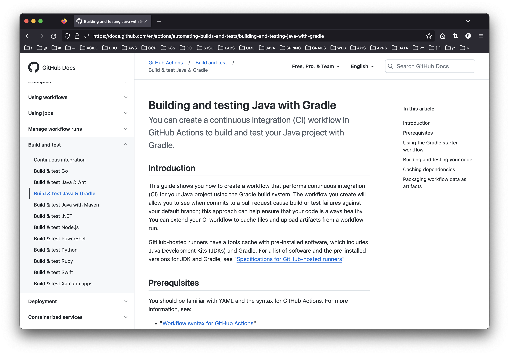

# spring-gumball ci/cd example

### This example demonstrates the following two GitHub Action Workflows.

* [Building and testing Java with Gradle](https://docs.github.com/en/actions/automating-builds-and-tests/building-and-testing-java-with-gradle) 
* [Deploying to Google Kubernetes Engine](https://docs.github.com/en/actions/deployment/deploying-to-your-cloud-provider/deploying-to-google-kubernetes-engine)

### Build Dependencies

* Gradle 5.6
* JDK 11

## CI Workflow (Part 1)

* https://docs.github.com/en/actions/automating-builds-and-tests/building-and-testing-java-with-gradle 

### Building and testing Java with Gradle

You can create a continuous integration (CI) workflow in GitHub Actions to build and test your Java project with Gradle.

#### Introduction

This guide shows you how to create a workflow that performs continuous integration (CI) for your Java project using the Gradle build system. The workflow you create will allow you to see when commits to a pull request cause build or test failures against your default branch; this approach can help ensure that your code is always healthy. You can extend your CI workflow to cache files and upload artifacts from a workflow run.

GitHub-hosted runners have a tools cache with pre-installed software, which includes Java Development Kits (JDKs) and Gradle. For a list of software and the pre-installed versions for JDK and Gradle, see [Specifications for GitHub-hosted runners](https://docs.github.com/en/actions/reference/specifications-for-github-hosted-runners/#supported-software).

