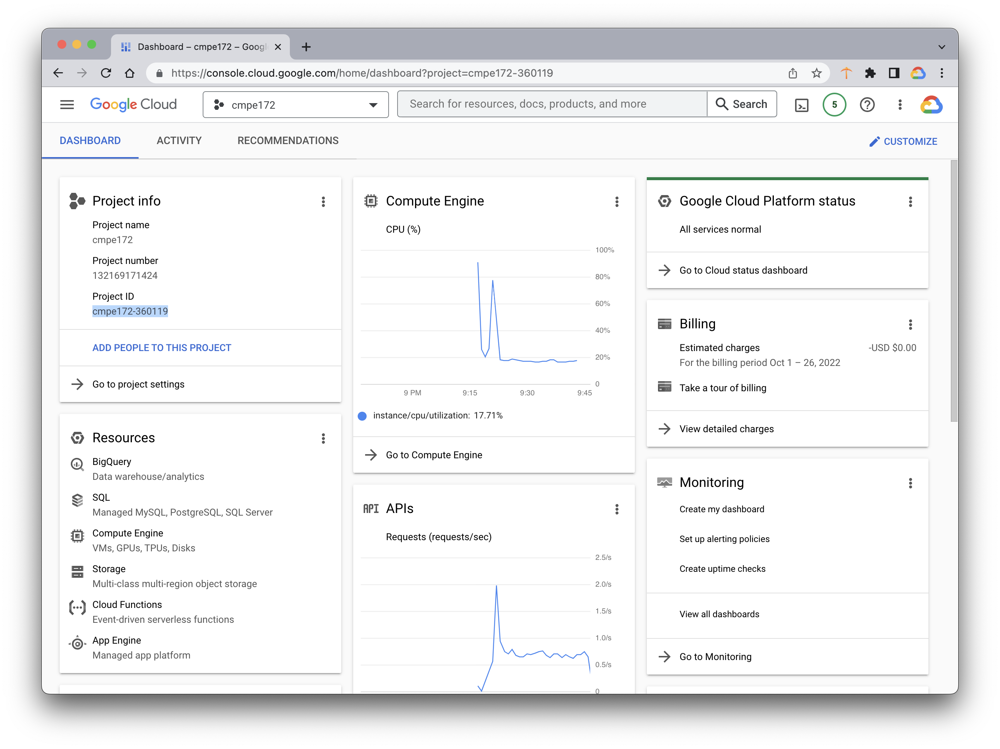

# spring-gumball ci/cd example

### This example demonstrates the following two GitHub Action Workflows.

* [Building and testing Java with Gradle](https://docs.github.com/en/actions/automating-builds-and-tests/building-and-testing-java-with-gradle) 
* [Deploying to Google Kubernetes Engine](https://docs.github.com/en/actions/deployment/deploying-to-your-cloud-provider/deploying-to-google-kubernetes-engine)

### Build Dependencies

* Gradle 5.6
* JDK 11


## CI Workflow (Part 1)

* https://docs.github.com/en/actions/automating-builds-and-tests/building-and-testing-java-with-gradle 


### Building and testing Java with Gradle

You can create a continuous integration (CI) workflow in GitHub Actions to build and test your Java project with Gradle.

#### Introduction

This guide shows you how to create a workflow that performs continuous integration (CI) for your Java project using the Gradle build system. The workflow you create will allow you to see when commits to a pull request cause build or test failures against your default branch; this approach can help ensure that your code is always healthy. You can extend your CI workflow to cache files and upload artifacts from a workflow run.

GitHub-hosted runners have a tools cache with pre-installed software, which includes Java Development Kits (JDKs) and Gradle. For a list of software and the pre-installed versions for JDK and Gradle, see [Specifications for GitHub-hosted runners](https://docs.github.com/en/actions/reference/specifications-for-github-hosted-runners/#supported-software).

#### Prerequisites

You should be familiar with YAML and the syntax for GitHub Actions. For more information, see:

* [Workflow syntax for GitHub Actions](https://docs.github.com/en/actions/using-workflows/workflow-syntax-for-github-actions)
* [Learn GitHub Actions](https://docs.github.com/en/actions/learn-github-actions)

We recommend that you have a basic understanding of Java and the Gradle framework. For more information, see [Getting Started](https://docs.gradle.org/current/userguide/getting_started.html) in the Gradle documentation.

#### Using the Gradle starter workflow

GitHub provides a Gradle starter workflow that will work for most Gradle-based Java projects. For more information, see the [Gradle starter workflow](https://github.com/actions/starter-workflows/blob/main/ci/gradle.yml).

To get started quickly, you can choose the preconfigured Gradle starter workflow when you create a new workflow. For more information, see the [GitHub Actions quickstart](https://docs.github.com/en/actions/quickstart).

You can also add this workflow manually by creating a new file in the **.github/workflows** directory of your repository.

**Set up your workflow to trigger on push and pr on main branch and optionally upload build artifact (i.e. jar file).**

For Example: **.github/workflows/gradle.yml**

```
# This workflow will build a Java project with Gradle
# See Also: https://docs.github.com/en/actions/automating-builds-and-tests/building-and-testing-java-with-gradle

name: Java CI with Gradle

on:
  push:
    branches: [ main ]
  pull_request:
    branches: [ main ]

jobs:
  build:

    runs-on: ubuntu-latest

    steps:
    # The checkout step downloads a copy of your repository on the runner.
    - uses: actions/checkout@v2

    # The setup-java step configures the Java 11 JDK by Adoptium.
    - name: Set up JDK 11
      uses: actions/setup-java@v2
      with:
        java-version: '11'
        distribution: 'adopt'

    # Make sure gradle wrapper is executable
    - name: Grant execute permission for gradlew
      run: chmod +x gradlew

    # The "Build with Gradle" step does a build using the gradle/gradle-build-action 
    # action provided by the Gradle organization on GitHub. The action takes care of 
    # invoking Gradle, collecting results, and caching state between jobs. 
    # For more information, See: https://github.com/gradle/gradle-build-action.      
    - name: Build with Gradle
      run: ./gradlew build

    # List the Build output folder to confirm JAR file was built
    - name: Build Result
      run: ls build/libs

    # Gradle will usually create output files like JARs, EARs, or WARs in the build/libs directory. 
    # You can upload the contents of that directory using the upload-artifact action.
    # See: https://docs.github.com/en/actions/using-workflows/storing-workflow-data-as-artifacts
    - name: Upload a Build Artifact
      uses: actions/upload-artifact@v2.2.3
      with:
        name: spring-gumball
        path: build/libs/spring-gumball-2.0.jar
```


Make a change to the code and commit to main branch to trigger the action. Take screenhots of your result.  For Example:


## CD Workflow (Part 2)

* https://docs.github.com/en/actions/deployment/deploying-to-your-cloud-provider/deploying-to-google-kubernetes-engine
* https://cloud.google.com/iam/docs/creating-managing-service-accounts
* https://kustomize.io


### Deploying to Google Kubernetes Engine

#### Introduction

This guide explains how to use GitHub Actions to build a containerized application, push it to Google Container Registry (GCR), and deploy it to Google Kubernetes Engine (GKE) when there is a push to the **main** branch.

GKE is a managed Kubernetes cluster service from Google Cloud that can host your containerized workloads in the cloud or in your own datacenter. For more information, see [Google Kubernetes Engine](https://cloud.google.com/kubernetes-engine).

Note: If your GitHub Actions workflows need to access resources from a cloud provider that supports OpenID Connect (OIDC), you can configure your workflows to authenticate directly to the cloud provider. This will let you stop storing these credentials as long-lived secrets and provide other security benefits. For more information, see "[About security hardening with OpenID Connect](https://docs.github.com/en/actions/deployment/security-hardening-your-deployments/about-security-hardening-with-openid-connect)"

#### Prerequisites

Before you proceed with creating the workflow, you will need to complete the following steps for your Kubernetes project. This guide assumes the root of your project already has a **Dockerfile** and a Kubernetes Deployment configuration file. For an example, see [google-github-actions](https://github.com/google-github-actions/setup-gcloud/tree/master/example-workflows/gke).

 
#### Creating a GKE cluster


##### Create the GKE cluster on GCP with the following paramters:

```
GCP Project:      cmpe172
GKE Cluster Name: cmpe172
GKE Cluster Zone: us-central1-c
```

* Create as **Standard: You manage your cluster**.


##### Enabling the APIs

* https://cloud.google.com/endpoints/docs/openapi/enable-api 

Enable the Kubernetes Engine and Container Registry APIs. 

* In the Google Cloud console, go to APIs & services for your project.
	* [Go to APIs & Services](https://console.cloud.google.com/apis)
	
* On the **Library page**, click **Private APIs**. If you don't see the API listed, that means you haven't been granted access to enable the API.

* Click the API you want to enable. If you need help finding the API, use the search field.  In the page that displays information about the API, click Enable.


* [Enable the Google Kubernetes Engine API](https://console.cloud.google.com/flows/enableapi?apiid=container.googleapis.com&_ga=2.135293809.1983438020.1666576943-332455251.1645430161).


##### Set up Secrets in your Workspace 

Example:

*  https://github.com/google-github-actions/setup-gcloud/tree/main/example-workflows/gke

```
GCP Project:      cmpe172
GKE Cluster Name: cmpe172
GKE Cluster Zone: us-central1-c

GKE_PROJECT:      cmpe172-360119
SA_NAME:          spring-gumball	
SA_EMAIL:         spring-gumball@cmpe172-360119.iam.gserviceaccount.com
GKE_SA_KEY:       <export json>
```

Find your GKE Project ID

* Navigate to Cloud Overview / Dashboard


		
* Note the "Project ID" in upper left Project Info section. 
   



* https://cloud.google.com/kubernetes-engine/docs/how-to/iam


	


